# 📚 BOOK US

**BOOK US**는 독서생활이라는 의미의 BOOK 과 함께하다라는 US를 합쳐서 만든 이름으로
다양한 콘텐츠들을 통해 함께 건강한 독서 생활을 만들어가는 웹 서비스입니다.  
재미있고 창의적인 기능들을 통해 독서 모임을 보다 즐겁고 풍성하게 만들어보세요!

---

## 💡 주요 기능

- 📖 **콘텐츠 기반 독서 활동**  
  다양한 토론, 퀴즈, 독후감 콘텐츠를 통해 흥미로운 독서 경험을 제공합니다.

- 🗺️ **모임 장소 설정 기능**  
  네이버 API를 활용하여 지도를 기반으로 오프라인 모임 장소를 직관적으로 설정할 수 있습니다.

- 💬 **책 한 줄 추천**  
  알라딘 API와 ChatGPT를 활용하여 책에 대한 한 줄 추천을 제공합니다.

---

## 개발 기간

25.04.04 ~ 25.05.27

## 🛠 기술 스택

| 구분         | 사용 기술                                              |
| ------------ | ------------------------------------------------------ |
| 프론트엔드   | Vue 3, JavaScript, Vite, Pinia                         |
| 백엔드       | Django (Python), JWT                                   |
| 데이터베이스 | SQLite3                                                |
| 기타         | Docker, ChatGPT, Naver API, Aladin API, Postman, Figma |
| 커뮤니케이션 | Gitlab, Notion, Clickup                                |

---

## 🚀 실행 방법

1. **Docker 기반 개발 환경 구성**
   docker-compose up -d

2. **프론트 엔드 실행**
   npm run dev

3. **백엔드 API 테스트**
   Postman을 사용해 Django REST API를 테스트

## 설계서

### ERD 설계

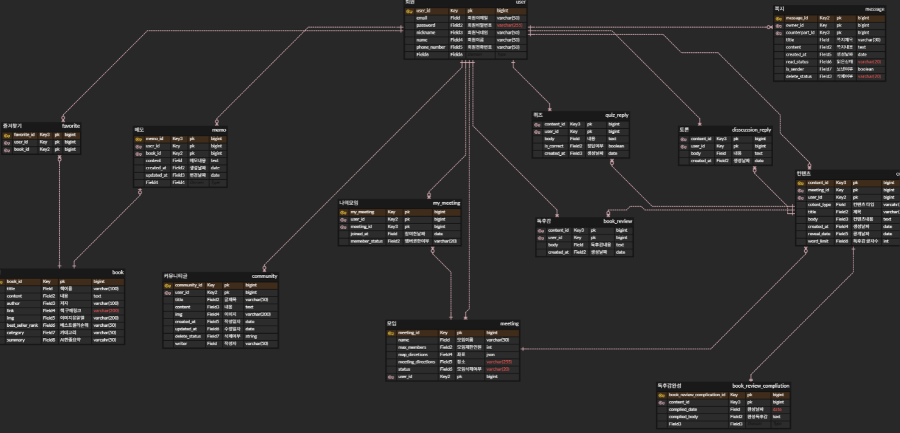

### 기능 명세서

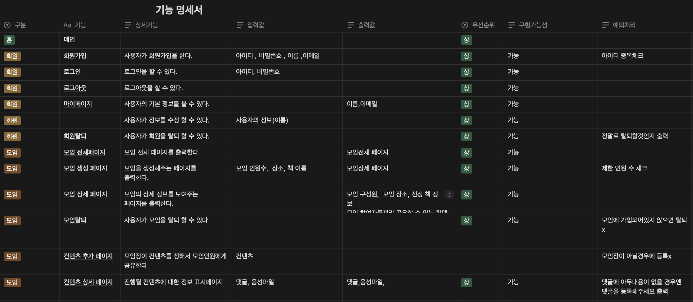
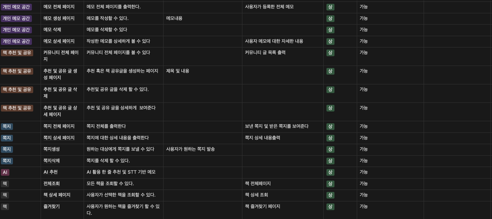

### 기능 상세서

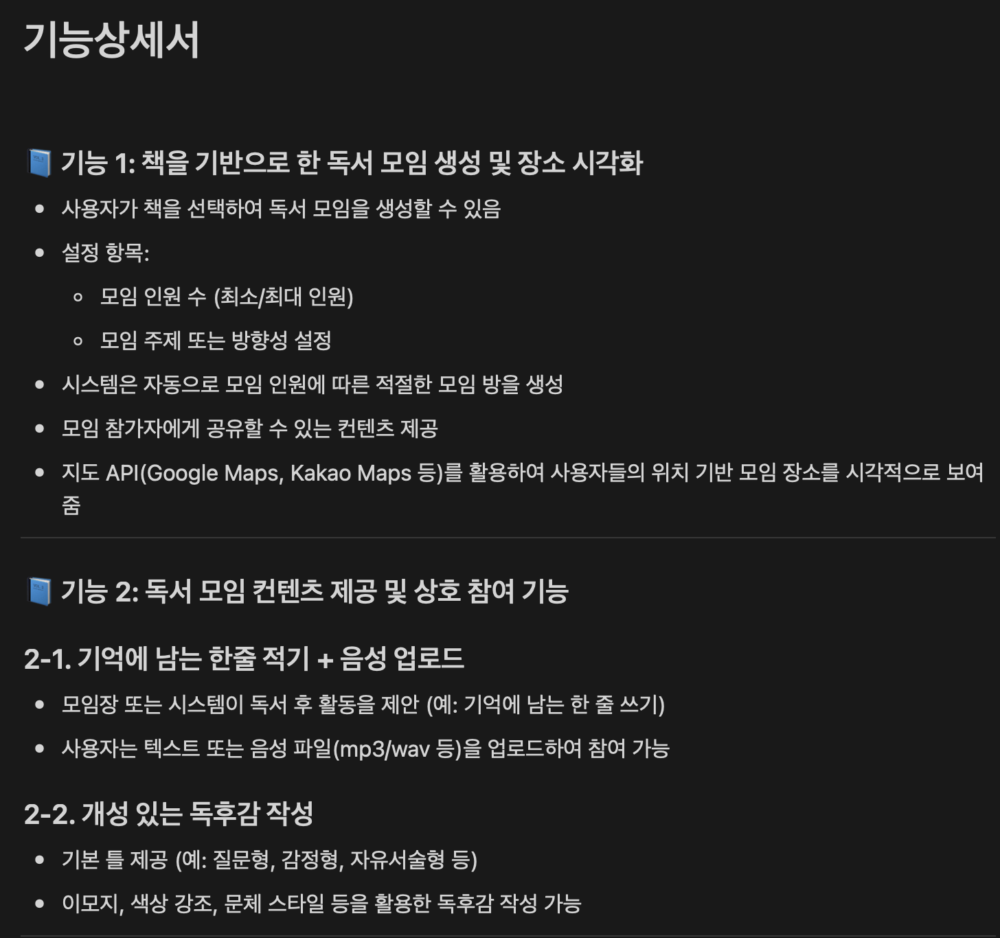
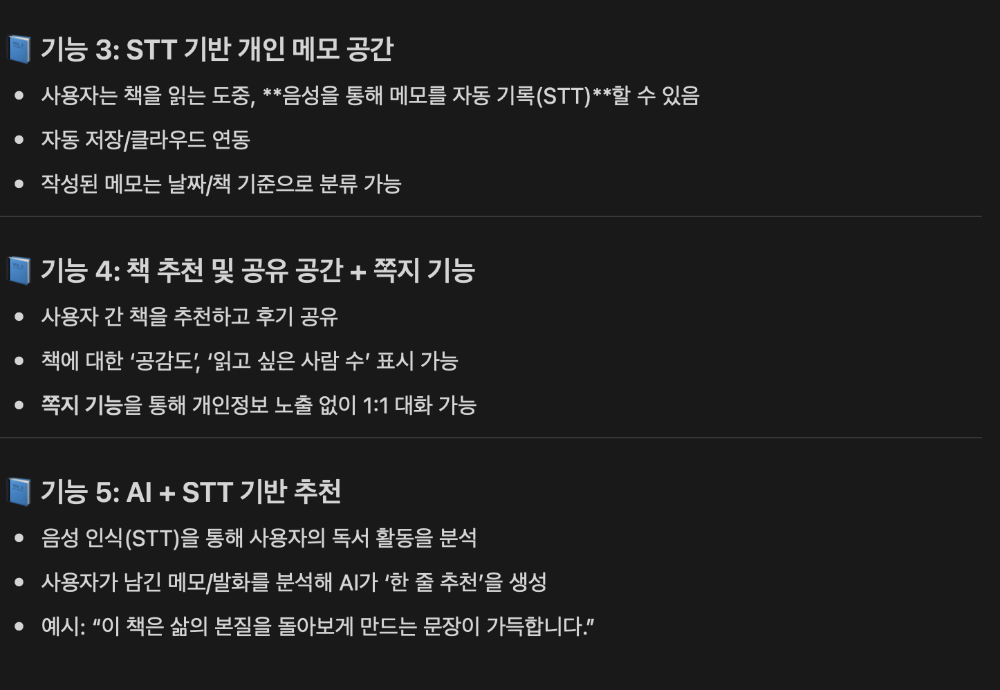

### 유즈 케이스

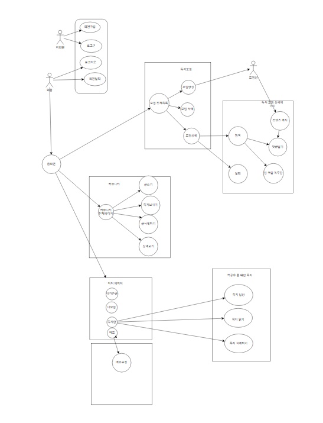

### API 명세

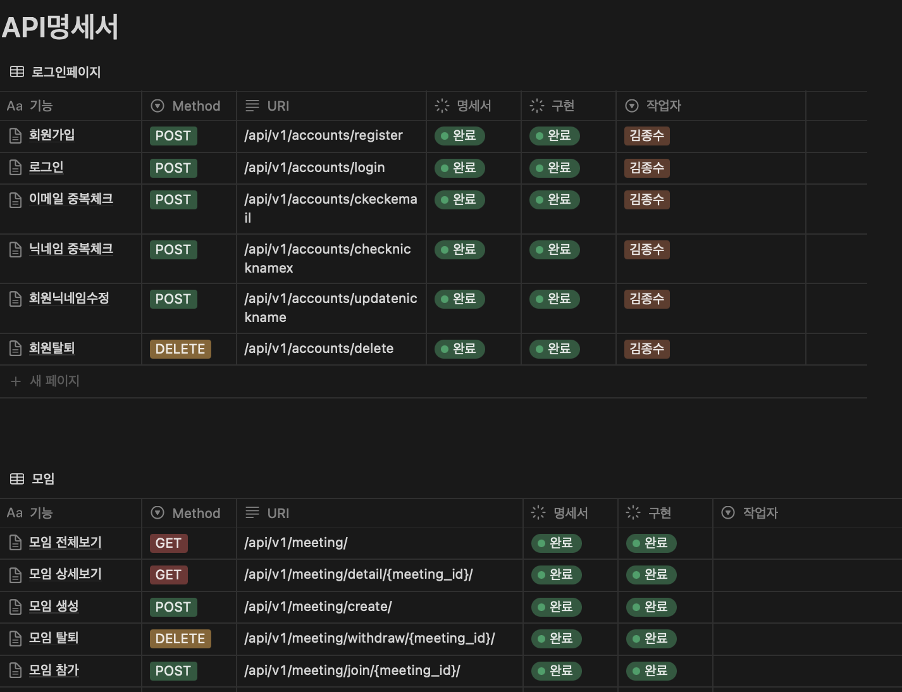
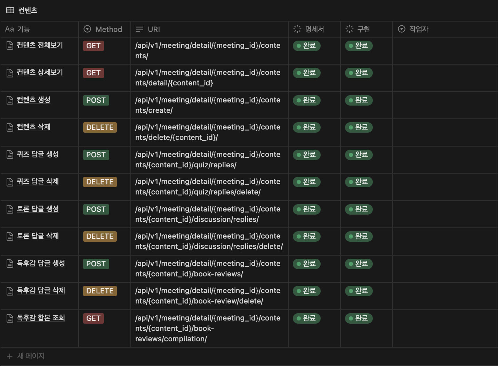
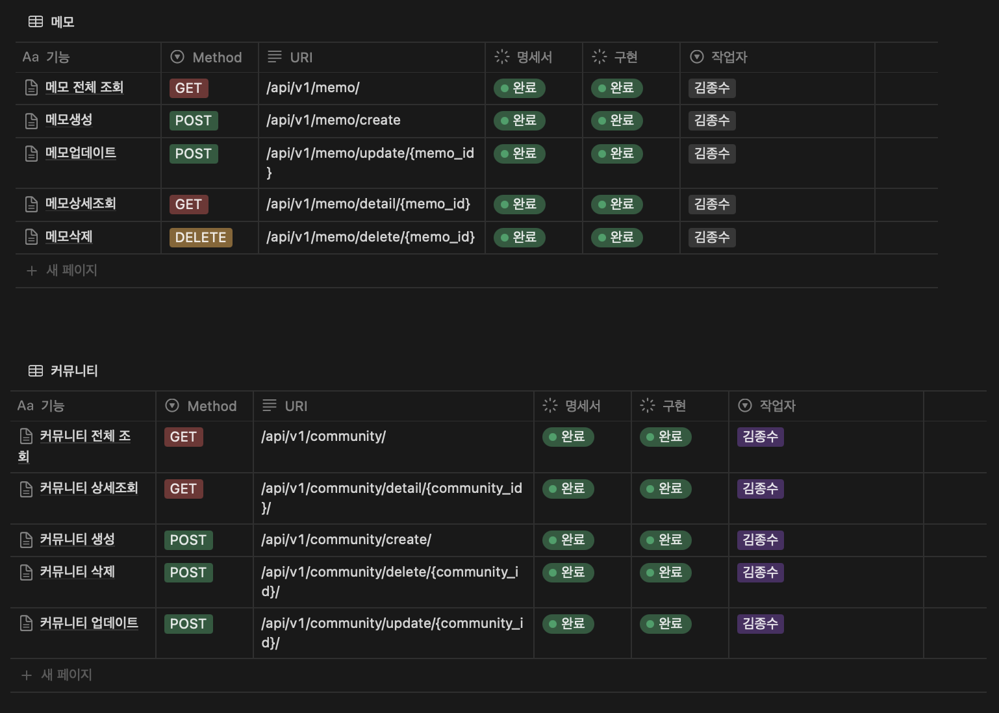
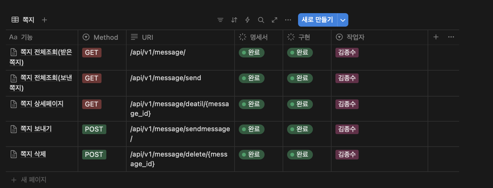

### Flow Chart

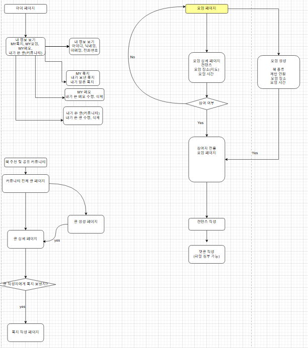

### 목업(피그마)

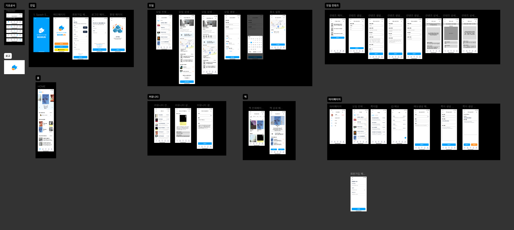
